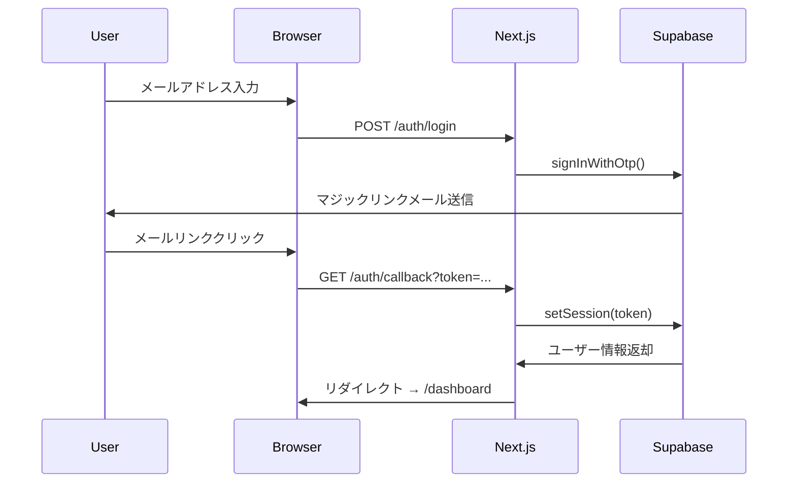
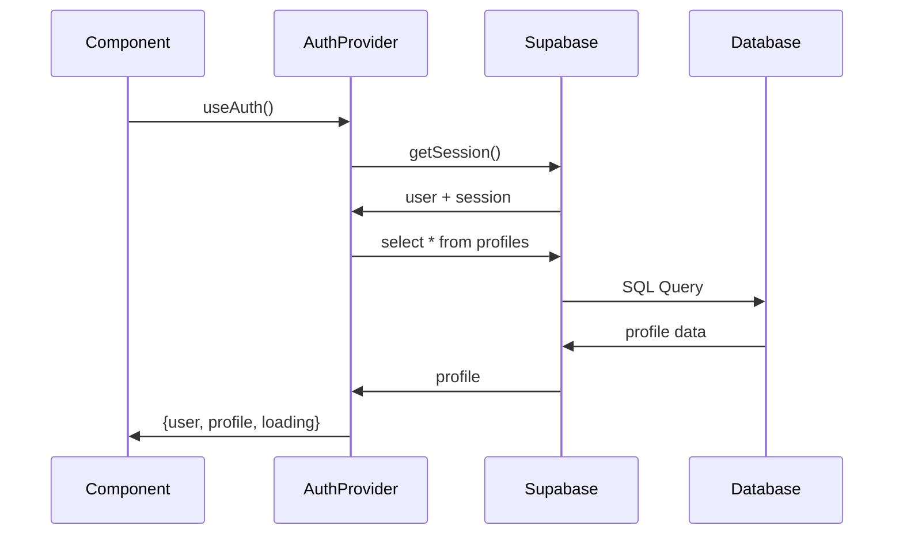

# Smart Press Monitor - 技術詳細ドキュメント

## 🔧 技術スタック詳細

### フロントエンド
```json
{
  "framework": "Next.js 15.5.2",
  "react": "19.1.0",
  "typescript": "^5",
  "bundler": "Turbopack",
  "styling": "Tailwind CSS ^4",
  "ui_library": "shadcn/ui",
  "form_handling": "react-hook-form ^7.62.0",
  "validation": "zod ^4.1.5",
  "icons": "lucide-react ^0.542.0"
}
```

### バックエンド・データベース
```json
{
  "database": "Supabase (PostgreSQL)",
  "auth": "Supabase Auth",
  "client": "@supabase/supabase-js ^2.56.1",
  "ssr": "@supabase/ssr ^0.7.0"
}
```

## 🏗️ アーキテクチャ図

```
┌─────────────────┐    ┌─────────────────┐    ┌─────────────────┐
│   ブラウザー      │    │   Next.js App   │    │   Supabase      │
│                 │    │                 │    │                 │
│ • React UI      │◄──►│ • App Router    │◄──►│ • PostgreSQL    │
│ • Tailwind CSS │    │ • TypeScript    │    │ • Auth          │
│ • Client State │    │ • Server Actions│    │ • RLS           │
└─────────────────┘    └─────────────────┘    └─────────────────┘
```

## 📁 プロジェクト構造

```
press_machine_db/
├── press-machine-web/                 # Next.jsアプリケーション
│   ├── src/
│   │   ├── app/                      # App Router (Next.js 13+)
│   │   │   ├── (pages)/
│   │   │   │   ├── page.tsx          # ダッシュボード
│   │   │   │   ├── layout.tsx        # ルートレイアウト
│   │   │   │   └── globals.css       # グローバルスタイル
│   │   │   ├── auth/
│   │   │   │   ├── login/page.tsx    # ログインページ
│   │   │   │   └── callback/page.tsx # 認証コールバック
│   │   │   ├── machines/
│   │   │   │   ├── page.tsx          # プレス機一覧
│   │   │   │   ├── new/page.tsx      # 新規登録
│   │   │   │   └── [id]/page.tsx     # 詳細・編集
│   │   │   └── maintenance/
│   │   │       └── page.tsx          # メンテナンス記録
│   │   ├── components/               # Reactコンポーネント
│   │   │   ├── auth/                 # 認証関連
│   │   │   ├── layout/               # レイアウト
│   │   │   ├── machines/             # プレス機管理
│   │   │   ├── maintenance/          # メンテナンス
│   │   │   └── ui/                   # UI基盤コンポーネント
│   │   ├── lib/                      # ユーティリティ
│   │   │   ├── supabase/             # Supabaseクライアント
│   │   │   └── utils.ts              # 汎用関数
│   │   └── types/
│   │       └── database.ts           # 型定義
│   ├── public/                       # 静的ファイル
│   ├── package.json                  # 依存関係
│   ├── tailwind.config.ts            # Tailwind設定
│   ├── next.config.ts                # Next.js設定
│   └── tsconfig.json                 # TypeScript設定
├── (データベース関連ファイル)/
│   ├── press_machine.db              # SQLiteデータ (開発用)
│   ├── *.py                          # データインポートスクリプト
│   ├── *.sql                         # SQL設定ファイル
│   └── *.csv                         # CSVデータファイル
└── (ドキュメント)/
    ├── CURRENT_SPECIFICATION.md     # 仕様書
    └── TECHNICAL_DETAILS.md         # 技術詳細 (このファイル)
```

## 🔗 データフロー

### 認証フロー


### データ取得フロー


## 🗄️ データベーススキーマ詳細

### RLS (Row Level Security) ポリシー
```sql
-- profiles テーブル
CREATE POLICY "Users can view own profile" ON profiles
    FOR SELECT USING (auth.uid() = user_id);

CREATE POLICY "Users can update own profile" ON profiles
    FOR UPDATE USING (auth.uid() = user_id);

-- press_machines テーブル
CREATE POLICY "Users can view org machines" ON press_machines
    FOR SELECT USING (
        org_id IN (
            SELECT org_id FROM profiles WHERE user_id = auth.uid()
        )
    );

-- maintenance_records テーブル
CREATE POLICY "Users can view org maintenance" ON maintenance_records
    FOR SELECT USING (
        org_id IN (
            SELECT org_id FROM profiles WHERE user_id = auth.uid()
        )
    );
```

### インデックス設計
```sql
-- パフォーマンス最適化用インデックス
CREATE INDEX idx_press_machines_org_id ON press_machines(org_id);
CREATE INDEX idx_press_machines_machine_number ON press_machines(machine_number);
CREATE INDEX idx_maintenance_records_org_id ON maintenance_records(org_id);
CREATE INDEX idx_maintenance_records_press_id ON maintenance_records(press_id);
CREATE INDEX idx_maintenance_records_datetime ON maintenance_records(maintenance_datetime);
CREATE INDEX idx_profiles_org_id ON profiles(org_id);
```

## ⚙️ 設定ファイル詳細

### Next.js設定 (next.config.ts)
```typescript
import type { NextConfig } from 'next'

const nextConfig: NextConfig = {
  experimental: {
    turbopack: {
      // Turbopack最適化設定
    }
  },
  typescript: {
    ignoreBuildErrors: false
  },
  eslint: {
    ignoreDuringBuilds: false
  }
}

export default nextConfig
```

### Tailwind設定 (tailwind.config.ts)
```typescript
import type { Config } from "tailwindcss"

const config: Config = {
  content: [
    "./src/**/*.{js,ts,jsx,tsx,mdx}",
  ],
  theme: {
    extend: {
      fontFamily: {
        sans: ["var(--font-geist-sans)"],
        mono: ["var(--font-geist-mono)"],
      }
    }
  },
  plugins: []
}

export default config
```

### TypeScript設定 (tsconfig.json)
```json
{
  "compilerOptions": {
    "lib": ["dom", "dom.iterable", "es6"],
    "allowJs": true,
    "skipLibCheck": true,
    "strict": true,
    "noEmit": true,
    "esModuleInterop": true,
    "module": "esnext",
    "moduleResolution": "bundler",
    "resolveJsonModule": true,
    "isolatedModules": true,
    "jsx": "preserve",
    "incremental": true,
    "plugins": [{ "name": "next" }],
    "baseUrl": ".",
    "paths": {
      "@/*": ["./src/*"]
    }
  },
  "include": ["next-env.d.ts", "**/*.ts", "**/*.tsx", ".next/types/**/*.ts"],
  "exclude": ["node_modules"]
}
```

## 🔐 環境変数・シークレット

### 必須環境変数
```bash
# .env.local
NEXT_PUBLIC_SUPABASE_URL=https://qlsntrswoaxdwrtobunw.supabase.co
NEXT_PUBLIC_SUPABASE_ANON_KEY=eyJhbGciOiJIUzI1NiIsInR5cCI6IkpXVCJ9...

# 本番環境追加予定
DATABASE_URL=postgresql://...
NEXTAUTH_SECRET=...
NEXTAUTH_URL=https://...
```

### Supabase設定詳細
```javascript
// Supabaseクライアント設定
const supabaseConfig = {
  auth: {
    persistSession: true,
    autoRefreshToken: true,
    detectSessionInUrl: true,
    storage: typeof window !== 'undefined' ? window.localStorage : undefined
  },
  global: {
    headers: {
      'X-Client-Info': 'smart-press-monitor@1.0.0'
    }
  }
}
```

## 🧪 テスト戦略

### 単体テスト (予定)
```bash
# Jest + React Testing Library
npm install --save-dev @testing-library/react @testing-library/jest-dom jest
```

### E2Eテスト (予定)
```bash
# Playwright
npm install --save-dev @playwright/test
```

### テスト対象
- [ ] 認証フロー
- [ ] CRUD操作
- [ ] フォームバリデーション
- [ ] データ表示
- [ ] レスポンシブ対応

## 🚀 デプロイメント

### 開発環境
```bash
# ローカル開発サーバー起動
npm run dev
# → http://localhost:3001
```

### 本番デプロイ (予定)
```bash
# ビルド
npm run build

# 本番サーバー起動
npm start

# または Vercelデプロイ
vercel --prod
```

### CI/CD パイプライン (予定)
```yaml
# .github/workflows/deploy.yml
name: Deploy
on:
  push:
    branches: [main]
jobs:
  build:
    runs-on: ubuntu-latest
    steps:
      - uses: actions/checkout@v4
      - uses: actions/setup-node@v4
      - run: npm ci
      - run: npm run build
      - run: npm run test
```

## 📊 モニタリング・ログ

### 現在のログ出力
```typescript
// 認証プロバイダーでのデバッグログ
console.log('Loading profile for user:', userId)
console.log('Profile query result:', { profile, profileError })
console.log('Auth state change:', event, session?.user?.id)
```

### 本番環境ログ (予定)
- Vercel Analytics
- Sentry (エラー追跡)
- Supabase Dashboard (データベースメトリクス)

## 🐛 トラブルシューティング

### 共通問題と解決策

1. **認証ループ問題**
   ```bash
   # 原因: ポート不一致、無限レンダリング
   # 解決: ポート統一、useEffect依存関係最適化
   ```

2. **データ読み込み失敗**
   ```bash
   # 原因: プロフィール/組織情報不足
   # 解決: デフォルト組織ID設定、エラーハンドリング
   ```

3. **ビルドエラー**
   ```bash
   # Next.jsルート競合
   rm src/app/auth/callback/route.ts  # page.tsxと競合する場合
   ```

### デバッグ用ページ
- `/debug` - 認証・データベース接続状況確認
- `/test` - 基本動作確認

## 🔄 今後の技術的改善点

### 短期改善 (1-2週間)
- [ ] プロフィール機能の安定化
- [ ] エラーハンドリング統一
- [ ] ローディング状態最適化
- [ ] 型安全性向上

### 中期改善 (1-2ヶ月)
- [ ] テスト導入
- [ ] パフォーマンス最適化
- [ ] PWA対応
- [ ] オフライン機能

### 長期改善 (3-6ヶ月)
- [ ] マイクロサービス化
- [ ] GraphQL導入
- [ ] リアルタイム同期
- [ ] AI機能統合

---

*技術仕様書 v1.0.0*
*最終更新: 2025年9月3日 09:44*