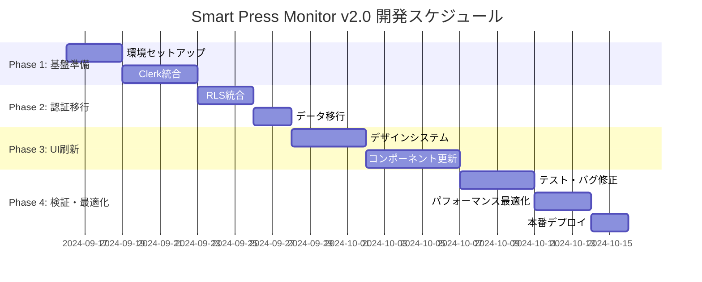

# 🚀 Smart Press Monitor v2.0 開発ロードマップ

## 📋 プロジェクト概要

### プロジェクト期間
- **開始日**: 2025年1月16日
- **最終更新**: 2025年9月16日
- **フェーズ**: 4つのメインフェーズ + 最終検証
- **現在のステータス**: Phase 2ほぼ完了、品質向上・最適化フェーズ移行

### 開発体制
- **メイン開発**: Claude Code + MCPツール（Serena, Context7, Playwright）
- **技術スタック**: Next.js 15, Clerk, Supabase, Tailwind CSS v4
- **開発手法**: アジャイル・反復開発

## 🎯 全体タイムライン



## 🏗️ Phase 1: 基盤準備（9/16-9/25, 7日間）

### Week 1.1: 環境セットアップ（9/16-9/18, 3日間）

#### Day 1: Clerk環境構築
```bash
# 目標: Clerkアカウント作成とNext.js統合
├── Clerkアカウント作成・設定
├── Next.jsプロジェクトにClerk統合
├── 基本認証フローの実装
└── 環境変数設定
```

**成果物**:
- Clerkダッシュボード設定完了
- 基本的なサインイン・サインアップページ
- `.env.local`の設定完了

**MCPツール活用**:
- **Context7**: `use context7` でClerk + Next.js 15の最新実装方法を参照
- **Serena**: 既存認証コードの構造分析とリファクタリング

#### Day 2: Tailwind CSS v4移行
```bash
# 目標: Tailwind CSS v4への完全移行
├── package.json更新（v3→v4）
├── postcss.config.mjs作成
├── globals.css更新
└── 既存スタイルの動作確認
```

**成果物**:
- Tailwind CSS v4設定完了
- 既存ページの表示確認
- デザインシステムの基盤準備

**MCPツール活用**:
- **Context7**: `use context7` でTailwind CSS v4の最新設定方法を確認
- **Playwright**: 既存ページの表示テスト自動化

#### Day 3: デザインシステム準備
```bash
# 目標: Apple風デザインシステムの基盤作成
├── カラーパレット定義
├── タイポグラフィ設定
├── コンポーネントライブラリ準備
└── アクセシビリティ基準設定
```

**成果物**:
- デザインシステムガイドライン完成
- shadcn/ui v2コンポーネント更新
- アクセシビリティテストツール設定

### Week 1.2: Clerk統合（9/19-9/22, 4日間）

#### Day 4-5: 認証フロー実装
```bash
# 目標: Clerk認証フローの完全実装
├── サインイン・サインアップページ刷新
├── ソーシャルログイン（Google, GitHub）
├── パスワードリセット機能
└── プロフィール管理ページ
```

**MCPツール活用**:
- **Context7**: Clerkの最新認証オプションとベストプラクティス参照
- **Serena**: 既存AuthProviderコンポーネントの段階的移行

#### Day 6-7: Supabase統合準備
```bash
# 目標: ClerkとSupabaseの統合基盤
├── カスタムヘッダー方式のSupabaseクライアント作成
├── 認証状態管理の実装
├── API Routes準備
└── テスト環境での動作確認
```

**成果物**:
- 認証統合ライブラリ完成
- API Routes認証ミドルウェア
- 開発環境での認証フロー確認

## 🔄 Phase 2: 認証移行（9/23-9/29, 7日間）

### Week 2.1: RLS統合（9/23-9/25, 3日間）

#### Day 8-9: RLSポリシー更新
```bash
# 目標: カスタムヘッダー対応RLS実装
├── 既存RLSポリシーの分析
├── カスタムヘッダー対応ポリシー作成
├── マイグレーションスクリプト準備
└── データアクセステスト
```

**成果物**:
- 新しいRLSポリシー（SQL）
- マイグレーションスクリプト
- アクセス権限テストケース

**MCPツール活用**:
- **Serena**: 既存のSupabaseクライアント呼び出し箇所の分析
- **Playwright**: データアクセス権限の自動テスト

#### Day 10: セキュリティテスト
```bash
# 目標: 認証・認可の徹底テスト
├── 組織間データ分離テスト
├── 不正アクセステスト
├── トークン管理テスト
└── セキュリティ脆弱性チェック
```

### Week 2.2: データ移行（9/26-9/29, 4日間）

#### Day 11-12: 移行戦略実装
```bash
# 目標: 既存データの完全保持移行
├── ユーザーマッピングテーブル作成
├── 段階的移行スクリプト作成
├── データ整合性チェック機能
└── ロールバック手順確立
```

**成果物**:
- データ移行ツール
- 整合性チェックスクリプト
- ロールバック手順書

#### Day 13-14: 移行実行・検証
```bash
# 目標: 実際の移行実行と検証
├── 開発環境での移行実行
├── 全データの整合性確認
├── 機能テスト実行
└── パフォーマンステスト
```

**MCPツール活用**:
- **Playwright**: 全機能の自動テスト実行
- **Serena**: データアクセス関連コードの検証

## 🎨 Phase 3: UI刷新（9/30-10/13, 14日間）

### Week 3.1: デザインシステム適用（9/30-10/3, 4日間）

#### Day 15-16: コアコンポーネント刷新
```bash
# 目標: 基本UIコンポーネントの完全刷新
├── Header・Navigationコンポーネント
├── Card・Button・Formコンポーネント
├── テーブル・ページネーションコンポーネント
└── モーダル・ダイアログコンポーネント
```

**成果物**:
- 新デザインシステム対応コンポーネント
- Storybookドキュメント（オプション）
- アクセシビリティテスト結果

#### Day 17-18: レイアウト・ナビゲーション
```bash
# 目標: 全体レイアウトとナビゲーションの刷新
├── レスポンシブレイアウト実装
├── ナビゲーション構造最適化
├── パンくずリスト実装
└── フッター・サイドバー（必要に応じて）
```

**MCPツール活用**:
- **Context7**: `use context7` でNext.js 15 App Routerの最新ナビゲーション手法
- **Playwright**: レスポンシブデザインの自動テスト

### Week 3.2-3.3: ページ別刷新（10/4-10/13, 10日間）

#### Day 19-21: 認証ページ群
```bash
# 目標: すべての認証関連ページの刷新
├── ログイン・サインアップページ
├── パスワードリセットページ
├── プロフィール設定ページ
└── 組織管理ページ（管理者用）
```

#### Day 22-24: ダッシュボード
```bash
# 目標: ダッシュボードの完全リニューアル
├── カード型レイアウトの実装
├── 統計データの可視化改善
├── チャート・グラフコンポーネント
└── リアルタイム更新機能
```

**成果物**:
- 新デザインダッシュボード
- データ可視化コンポーネント
- パフォーマンス最適化

#### Day 25-27: プレス機管理ページ
```bash
# 目標: プレス機管理機能の刷新
├── 一覧ページのテーブルUI改善
├── 検索・フィルタリング機能強化
├── 詳細・編集ページのフォーム改善
└── 新規登録ページの最適化
```

#### Day 28: メンテナンス管理ページ
```bash
# 目標: メンテナンス管理機能の刷新
├── 記録一覧ページの改善
├── 新規作成フォームのステップ化
├── 編集ページの使いやすさ向上
└── 統計・レポート表示改善
```

**MCPツール活用**:
- **Serena**: 既存フォームロジックの分析と最適化
- **Context7**: React Hook Form + Zodの最新パターン参照
- **Playwright**: フォーム入力・送信の自動テスト

## ✅ Phase 4: 検証・最適化（10/14-10/31, 18日間）

### Week 4.1: 機能テスト（10/14-10/17, 4日間）

#### Day 29-30: 統合テスト
```bash
# 目標: 全機能の統合テスト実行
├── 認証フローテスト（全パターン）
├── データCRUD操作テスト
├── 権限・セキュリティテスト
└── エラーハンドリングテスト
```

**MCPツール活用**:
- **Playwright**: E2Eテストスイートの実行
- **Serena**: 統合テストコードの生成・実行

#### Day 31-32: ユーザビリティテスト
```bash
# 目標: UX・アクセシビリティテスト
├── キーボードナビゲーションテスト
├── スクリーンリーダーテスト
├── カラーコントラストチェック
└── レスポンシブデザインテスト
```

### Week 4.2: パフォーマンス最適化（10/18-10/20, 3日間）

#### Day 33-35: 最適化実装
```bash
# 目標: パフォーマンス目標達成
├── Core Web Vitals最適化
├── バンドルサイズ削減
├── 画像最適化・遅延読み込み
└── キャッシュ戦略最適化
```

**成果物**:
- Lighthouse スコア 90点以上
- バンドルサイズ 20%削減
- ページ読み込み 3秒以内

### Week 4.3: 本番準備（10/21-10/31, 11日間）

#### Day 36-40: 本番環境準備
```bash
# 目標: 本番デプロイメント準備
├── 本番環境Clerk設定
├── Supabase本番環境準備
├── 環境変数・シークレット管理
└── CDN・キャッシュ設定
```

#### Day 41-43: データ移行実行
```bash
# 目標: 本番データの安全な移行
├── 本番データバックアップ
├── 段階的移行実行
├── データ整合性確認
└── 機能テスト実行
```

#### Day 44-46: 最終検証・デプロイ
```bash
# 目標: システム稼働開始
├── 本番環境での最終テスト
├── ドキュメント最終更新
├── 本番デプロイ実行
└── 稼働監視開始
```

## 📊 品質管理指標

### 各フェーズの完了基準

#### Phase 1: 基盤準備 ✅ 完了（2025/1/16）
- [x] Clerk認証の基本動作確認
- [x] Tailwind CSS v3の継続使用（安定性重視）
- [ ] デザインシステムガイドライン完成（次フェーズへ）
- [x] 開発環境の完全セットアップ

#### Phase 2: 認証移行 ✅ ほぼ完了（2025/9/16）
- [x] Clerk-Supabase統合完了
- [x] 既存データの100%保持確認
- [x] Supabaseクライアント最適化（シングルトン化）
- [x] 認証フローの完全動作
- [x] ビルドエラー修正（.bakファイル削除）
- [ ] RLSポリシー再有効化（保留中）
- [ ] リントエラー修正（品質向上フェーズへ）

## 🔧 現在の課題と次期フェーズ（2025/9/16時点）

### ✅ 完了済み項目
1. **Clerk認証統合**: 完全動作、サインイン・サインアップページ実装済み
2. **Supabase接続**: カスタムヘッダー方式で統合、シングルトン化完了
3. **ビルド成功**: プロダクションビルドが正常に完了
4. **基本機能**: 機械管理、メンテナンス記録、分析ページ動作確認

### 🚧 進行中/未完了項目
1. **コード品質**: ESLintエラー81件（40エラー、41警告）
2. **maintenance_schedulesテーブル**: スキーマ準備済みだが実装保留
3. **RLSポリシー**: セキュリティ向上のため再有効化必要
4. **ミドルウェアエラー**: 認証リダイレクト時のunhandledRejection警告

## 🎯 次期開発フェーズ（2025/9/16以降）

### Phase 2.5: 品質向上・安定化（優先度：高）

#### Week 1: コード品質向上（推定3-5日）
```bash
# 目標: ESLintエラー0件、型安全性向上
├── TypeScript型定義の修正（any型の置換）
├── React Hooks依存関係の修正
├── 未使用変数・import の削除
├── prefer-const エラーの修正
└── 自動フォーマッティング設定
```

**優先修正項目**:
1. **型安全性**: `any`型を適切な型に置換（40箇所）
2. **React Hooks**: useEffect依存関係の修正（15箇所）
3. **未使用コード**: 未使用変数・importの削除（20箇所）
4. **設定ファイル**: fix-orgs.js、test-supabase.jsの修正

#### Week 2: ミドルウェア・エラーハンドリング改善（推定2-3日）
```bash
# 目標: 認証エラーの解決、安定性向上
├── ClerkミドルウェアのunhandledRejection修正
├── 404エラーハンドリングの改善
├── 認証リダイレクトの最適化
└── エラー境界コンポーネントの実装
```

#### Week 3: データベース機能完成（推定2-3日）
```bash
# 目標: maintenance_schedulesテーブル実装
├── Supabaseダッシュボードでテーブル作成
├── コメントアウト機能の有効化
├── スケジュール管理UIの実装
└── データ整合性テスト
```

### Phase 3: UI/UX改善（優先度：中）

#### 改善対象ページ（優先度順）
1. **ダッシュボード**: 統計表示の改善、カード型レイアウト
2. **機械管理**: 検索・フィルタリング機能強化
3. **メンテナンス管理**: フォームUXの改善
4. **認証ページ**: Clerkコンポーネントのカスタマイズ

### Phase 4: セキュリティ・パフォーマンス（優先度：中）

```bash
# 目標: 本番レディ化
├── RLSポリシーの再有効化
├── Lighthouse スコア90点以上
├── セキュリティテスト実行
└── パフォーマンス最適化
```

#### Phase 3: UI刷新
- [ ] 全ページの新デザイン適用
- [ ] アクセシビリティ基準達成
- [ ] レスポンシブデザイン確認
- [ ] ユーザビリティテストパス

#### Phase 4: 検証・最適化
- [ ] 全機能の統合テストパス
- [ ] パフォーマンス目標達成
- [ ] 本番環境での安定動作
- [ ] ドキュメント完備

## 🔧 MCPツール活用戦略

### 日常開発での活用

#### Context7
```bash
# 毎日の開発で使用
use context7 # 最新技術情報の取得
- Clerk + Next.js 15の最新実装パターン
- Tailwind CSS v4の新機能活用
- React Hook Formの最適な使い方
- アクセシビリティベストプラクティス
```

#### Serena
```bash
# コード分析・リファクタリングで使用
- 既存コンポーネントの構造分析
- 認証関連コードの段階的移行
- データアクセスパターンの最適化
- テストコードの自動生成
```

#### Playwright
```bash
# 品質保証で使用
- 認証フローのE2Eテスト
- フォーム入力・送信テスト
- レスポンシブデザインテスト
- アクセシビリティテスト
```

## 🎯 成功指標・KPI

### 開発効率
- **コード品質**: ESLint エラー 0件
- **テストカバレッジ**: 80%以上
- **バグ修正時間**: 平均2時間以内
- **機能実装速度**: 予定比110%以上

### ユーザーエクスペリエンス
- **ページ読み込み時間**: 3秒以内
- **Lighthouse スコア**: 90点以上
- **アクセシビリティ**: WCAG 2.1 AA準拠
- **ユーザー満足度**: 8/10以上

### システム品質
- **セキュリティテスト**: 100%パス
- **稼働率**: 99.9%以上
- **データ整合性**: 100%保持
- **パフォーマンス**: Core Web Vitals良好

## 📋 リスク管理

### 高リスク項目
1. **データ移行の失敗** → バックアップ・ロールバック戦略確立
2. **認証統合の複雑化** → 段階的実装・テスト強化
3. **パフォーマンス劣化** → 継続的監視・最適化
4. **UI変更による使いにくさ** → ユーザビリティテスト強化

### 対策
- 各フェーズでの品質ゲート設定
- 毎日の進捗確認・課題解決
- MCPツールによる効率的開発
- 継続的テスト・検証の実施

---

**このロードマップに沿って、高品質なSmart Press Monitor v2.0を構築していきます！** 🚀