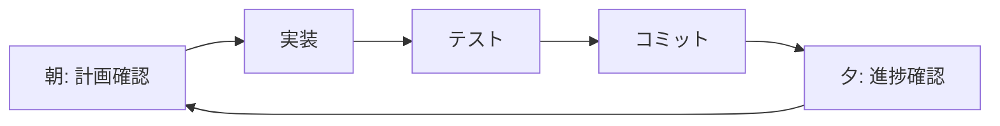
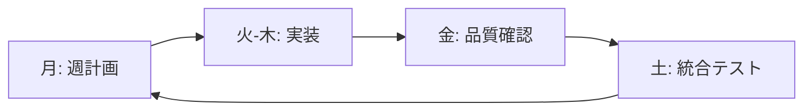

# 🛠️ Smart Press Monitor v2.0 実装計画書

## 📋 実装開始準備

### 現在の状況
- ✅ 要件定義完了
- ✅ 開発ロードマップ作成完了  
- ✅ MCPツール統合済み（Serena, Context7, Playwright）
- ✅ 技術仕様書・デザインガイド完備

### 今すぐ開始可能な作業

## 🚀 Phase 1: 基盤準備 - 即時開始可能

### 1-1. Clerk環境構築（今すぐ開始）

#### Step 1: Clerkアカウントセットアップ
```bash
# 実行手順
1. https://clerk.com でアカウント作成
2. 新しいアプリケーション作成
3. 認証プロバイダー設定（Email, Google, GitHub）
4. 開発環境ドメイン設定
```

#### Step 2: パッケージインストール use context7
```bash
cd press-machine-web
npm install @clerk/nextjs @clerk/themes
```

#### Step 3: 環境変数設定
```bash
# .env.local に追加
NEXT_PUBLIC_CLERK_PUBLISHABLE_KEY=pk_test_...
CLERK_SECRET_KEY=sk_test_...
NEXT_PUBLIC_CLERK_SIGN_IN_URL=/auth/sign-in
NEXT_PUBLIC_CLERK_SIGN_UP_URL=/auth/sign-up
NEXT_PUBLIC_CLERK_AFTER_SIGN_IN_URL=/
NEXT_PUBLIC_CLERK_AFTER_SIGN_UP_URL=/
```

### 1-2. Tailwind CSS v4移行（並行実行）

#### 現在の設定確認
```bash
# 現在のTailwind設定を確認
cat press-machine-web/package.json | grep tailwind
cat press-machine-web/tailwind.config.js
```

#### v4移行手順
```bash
# パッケージ更新
npm uninstall tailwindcss
npm install -D tailwindcss@next @tailwindcss/postcss

# PostCSS設定作成
cat > postcss.config.mjs << 'EOF'
export default {
  plugins: {
    '@tailwindcss/postcss': {},
  },
}
EOF

# CSS更新
cat > src/app/globals.css << 'EOF'
@import "tailwindcss";
EOF
```

## 🔧 MCPツール活用による効率的実装

### Context7の活用戦略
```bash
# 各実装段階でContext7を活用
"Clerk + Next.js 15 App Routerの最新実装方法を教えて。use context7"
"Tailwind CSS v4でレスポンシブデザインの最適な書き方は？use context7"
"React Hook FormとZodでアクセシブルなフォームの作り方は？use context7"
```

### Serenaの活用戦略
```bash
# 既存コード分析・リファクタリング
- 既存AuthProviderの構造分析
- Supabaseクライアント呼び出し箇所の特定
- 認証関連コンポーネントの依存関係マッピング
- データアクセスパターンの統一
```

### Playwrightの活用戦略
```bash
# 自動テスト・品質保証
- 認証フローのE2Eテスト作成
- 既存機能の回帰テスト
- レスポンシブデザインテスト
- アクセシビリティ検証
```

## 📅 第1週の具体的実装スケジュール

### Day 1 (今日): 環境構築開始

#### 午前 (2-3時間)
```bash
□ Clerkアカウント作成・設定
□ 開発環境にClerkパッケージインストール
□ 基本認証設定の実装
□ 動作確認（簡単なログインページ）
```

#### 午後 (2-3時間)  
```bash
□ Tailwind CSS v4への移行
□ 既存ページの表示確認・修正
□ デザインシステムの基盤準備
□ Git コミット・プッシュ
```

**成果物**: 
- Clerk基本認証フロー
- Tailwind CSS v4動作環境
- 移行進捗レポート

### Day 2: 認証統合深化

#### 実装項目
```typescript
// 優先実装コンポーネント
1. ClerkProvider設定 (layout.tsx)
2. 新しいサインイン・サインアップページ
3. AuthProvider の Clerk対応更新
4. 基本的なミドルウェア設定
```

**MCPツール活用**:
```bash
# Context7で最新実装パターン確認
"Clerk + Next.js 15でのミドルウェア実装の最適解は？use context7"

# Serenaで既存コード分析
既存 AuthProvider.tsx の構造を分析し、Clerk対応への変更点を特定
```

### Day 3: Supabase統合準備

#### 実装項目
```typescript
// カスタムヘッダー対応Supabaseクライアント
1. createAuthenticatedSupabaseClient() 関数
2. API Routes での認証ミドルウェア
3. RLS対応の準備
4. 認証状態管理の統合
```

## 🏗️ コードレベル実装計画

### 1. Clerk統合実装

#### layout.tsx の更新
```typescript
// press-machine-web/src/app/layout.tsx
import { ClerkProvider } from '@clerk/nextjs'

export default function RootLayout({
  children,
}: {
  children: React.ReactNode
}) {
  return (
    <ClerkProvider>
      <html lang="ja">
        <body className={inter.className}>
          <AuthProvider>
            {children}
          </AuthProvider>
        </body>
      </html>
    </ClerkProvider>
  )
}
```

#### 新しい認証ページ
```bash
# 作成するファイル
press-machine-web/src/app/auth/sign-in/[[...sign-in]]/page.tsx
press-machine-web/src/app/auth/sign-up/[[...sign-up]]/page.tsx
press-machine-web/src/middleware.ts
```

#### AuthProvider の更新
```typescript
// press-machine-web/src/components/auth/AuthProvider.tsx
import { useUser, useAuth as useClerkAuth } from '@clerk/nextjs'

export function AuthProvider({ children }: { children: React.ReactNode }) {
  const { user, isLoaded } = useUser()
  const { getToken } = useClerkAuth()
  
  // Clerk + Supabase統合ロジック
  // ...
}
```

### 2. Supabase統合実装

#### カスタムヘッダークライアント
```typescript
// press-machine-web/src/lib/supabase/clerk-client.ts
import { createClient } from '@supabase/supabase-js'
import { auth } from '@clerk/nextjs/server'

export async function createAuthenticatedSupabaseClient() {
  const { userId, getToken } = await auth()
  
  if (!userId) {
    throw new Error('Unauthorized')
  }

  const token = await getToken({ template: 'supabase' })
  
  const supabase = createClient(
    process.env.NEXT_PUBLIC_SUPABASE_URL!,
    process.env.NEXT_PUBLIC_SUPABASE_ANON_KEY!,
    {
      global: {
        headers: {
          'clerk-user-id': userId,
          Authorization: `Bearer ${token}`,
        },
      },
    }
  )

  return supabase
}
```

#### RLSポリシー更新
```sql
-- database/clerk-rls-migration.sql
-- 既存ポリシーを削除
DROP POLICY IF EXISTS "press_machines_select" ON press_machines;

-- Clerkユーザー対応の新しいポリシー
CREATE POLICY "press_machines_clerk_select" ON press_machines
  FOR SELECT USING (
    org_id = (current_setting('app.current_org_id', true))::UUID
  );
```

### 3. デザインシステム実装

#### カラーシステム適用
```typescript
// press-machine-web/src/components/ui/button.tsx
// 新しいデザインシステムでButtonコンポーネント更新

const buttonVariants = cva(
  // ベーススタイル（アクセシビリティ対応）
  "inline-flex items-center justify-center rounded-xl text-sm font-medium transition-all focus-visible:outline-none focus-visible:ring-2 focus-visible:ring-blue-600 focus-visible:ring-offset-2 disabled:pointer-events-none disabled:opacity-50",
  {
    variants: {
      variant: {
        default: "bg-blue-600 text-white hover:bg-blue-700 shadow-sm",
        outline: "border border-gray-300 bg-white text-gray-700 hover:bg-gray-50",
        // ... 他のバリエーション
      },
      size: {
        sm: "h-8 px-3 text-xs rounded-lg",
        default: "h-10 px-4 py-2 rounded-xl", 
        lg: "h-12 px-6 text-base rounded-2xl",
      },
    },
    defaultVariants: {
      variant: "default",
      size: "default",
    },
  }
)
```

## 🧪 テスト戦略

### 1. 段階的テスト実装

#### 認証テスト（Playwright）
```typescript
// tests/auth.spec.ts
import { test, expect } from '@playwright/test'

test.describe('認証フロー', () => {
  test('メール・パスワードでログインできる', async ({ page }) => {
    await page.goto('/auth/sign-in')
    
    await page.fill('[name="email"]', 'test@example.com')
    await page.fill('[name="password"]', 'password123')
    await page.click('[type="submit"]')
    
    await expect(page).toHaveURL('/')
    await expect(page.getByText('ダッシュボード')).toBeVisible()
  })

  test('Googleでログインできる', async ({ page }) => {
    await page.goto('/auth/sign-in')
    await page.click('text=Googleでログイン')
    // OAuth フロー テスト
  })
})
```

#### データアクセステスト
```typescript
// tests/data-access.spec.ts
test('組織データの分離が正しく動作する', async ({ page }) => {
  // 組織Aのユーザーでログイン
  await loginAsUser('org-a-user@example.com')
  
  // 組織Aのデータのみ表示されることを確認
  await page.goto('/machines')
  await expect(page.getByText('組織Bの機械')).not.toBeVisible()
})
```

### 2. アクセシビリティテスト
```bash
# 自動アクセシビリティテスト
npm install -D @axe-core/playwright

# tests/accessibility.spec.ts で全ページをテスト
test('全ページがWCAG 2.1 AAに準拠', async ({ page }) => {
  await page.goto('/')
  const results = await injectAxe(page)
  expect(results.violations).toEqual([])
})
```

## 📊 進捗管理・品質管理

### 1. 日次進捗確認
```bash
# 毎日の実装後にチェック
□ 新機能の動作確認
□ 既存機能の回帰テスト（Playwright実行）
□ コード品質チェック（ESLint, TypeScript）
□ アクセシビリティチェック
□ Git コミット・プッシュ
```

### 2. 週次品質ゲート
```bash
# 各週末に実施
□ 全機能のE2Eテスト実行
□ パフォーマンス測定（Lighthouse）
□ セキュリティチェック
□ ドキュメント更新
□ 次週計画の調整
```

## 🎯 今すぐ開始するアクション

### 即座に実行可能なタスク（優先順）

1. **Clerkアカウント作成** (15分)
   ```bash
   1. https://clerk.com でアカウント作成
   2. 新規アプリケーション作成
   3. 認証プロバイダー設定
   ```

2. **パッケージインストール** (5分)
   ```bash
   cd press-machine-web
   npm install @clerk/nextjs @clerk/themes
   ```

3. **環境変数設定** (10分)
   ```bash
   # .env.local にClerk設定追加
   ```

4. **基本認証ページ作成** (30分)
   ```bash
   # Context7活用: "Clerk + Next.js 15の最新認証実装 use context7"
   ```

5. **Tailwind CSS v4移行** (20分)
   ```bash
   # パッケージ更新・設定変更
   ```

## 🔄 反復開発プロセス

### 日次サイクル


### 週次サイクル  


---

**この実装計画に従って、今すぐSmart Press Monitor v2.0の開発を開始しましょう！** 🚀

**次のアクション**: Clerkアカウント作成から開始し、段階的に実装を進めていきます。各ステップでMCPツールを最大限活用して効率的な開発を実現します。